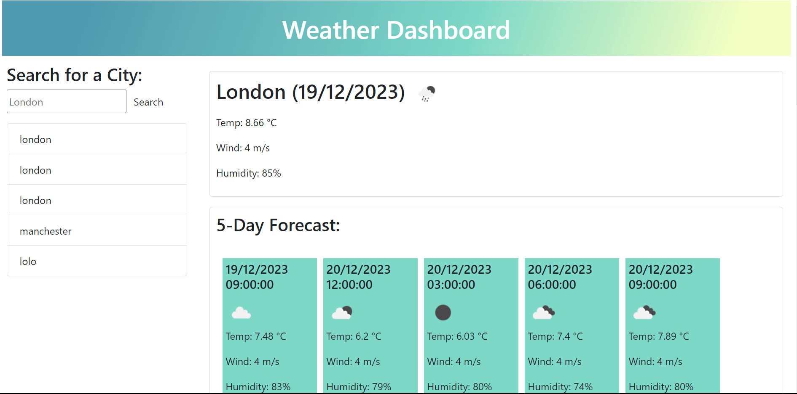

# Weather-Dashboard
This application is a weather dashboard. The user can search city names to get the weather info. 

## Installation

N/A

## Usage

You can try out the Javascript coding quiz if you click this link:

https://sara-badini-confalonieri.github.io/Weather-Dashboard/

* Enter a city name in the input box
* The Current weather will display on the top of the page, followed by a 5-days weather forecast for the choosen city.
* Every city searched will be saved in the local storage making it possible to reselect an old search.

## Credits

N/A

## License

Please refer to the LICENSE in the repo.

